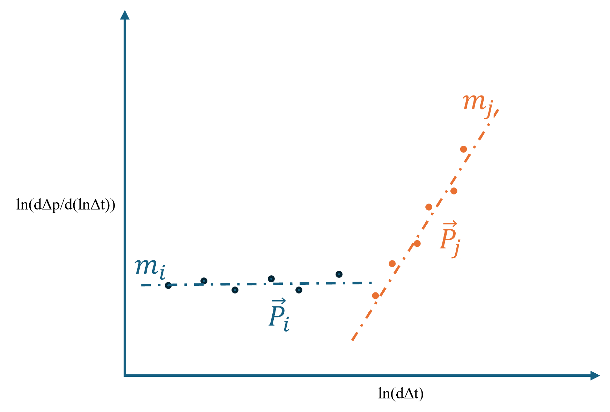
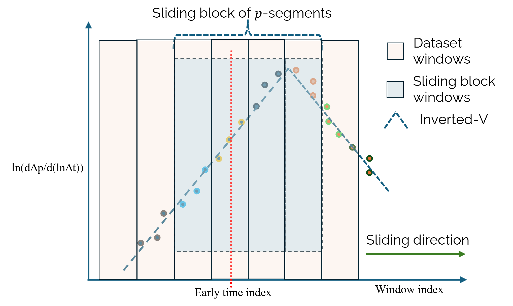

# Flow Regime Identification Using K-Means and K-Medoids Clustering

## Summary
This Python script identifies flow regimes present in a pressure transient diagnostic data. It applies both **K-Means** and **K-Medoids** clustering techniques, as well as semi-automated K-clustering using the Elbow method. It can reliably partition the diagnostic data into the different flow regimes by integrating various subject-specific diagnostic indicators. 
The program implements a sliding window approach to segment the pressure transient diagnostic data. Two standard partitioning techniques are utilized:
- **K-Means:** Applies Euclidean distance metric on segments, where each segment is characterized by a set of normalized mid-point (x, y) coordinates, along with slope and index information.
- **K-Medoids:** Applies a weighted composite pair-wise dissimilarity between segments, where each segment is characterized by Euclidean distance, angular difference, temporal and pattern information.

## Main Features

- **Composite-Metric Integration:** Combines several metrics, such as:
  - **Euclidean Distance:** Measures geometric differences.
  - **Angular Difference:** Computes differences in trends (slope) among segments.
  - **Temporal Penalty:** Disincentivizes cluster switching, especially on boundaries (i.e., prevents repeating clusters).
  - **Inverted-V Identification:** Recognizes a specific transient pattern which occurs in the early time region (ETR). This is an inverted-V, which indicates the strong wellbore storage on the left side of       the pattern and the weak wellbore storage on the right side of the pattern.
- **Semi-Automated Cluster Selection:** Applies the Elbow method, a heuristic technique, to find the most suitable number of clusters.
    
## Methodology

### Data Segmentation

The pressure diagnostic data is divided into segments by using a sliding window. Segment-by-segment analysis is more effective for flow regime identification because flow regimes are a cluster of data points (i.e., a segment). Segmentation also helps to reduce noise, making the analysis more credible.

### Feature Computation

For each segment, a set of features is extracted by computing a number of metrics as illustrated in Figure 1.


#### K-Means Clustering

Each segment is expressed as a set of normalized values consisting of:
  - **Mid-point \(x, y\) Coordinates:** The x and y coordinates, and median of all data points in the segment.
  - **Slope:** Derived using linear regression to determine the trend of the segment.
  - **Index Information:** The position of the segment within the dataset.
**Distance Calculation:** The set of normalized values are vertically stacked and used to compute a distance metric using the Euclidean norm. 

#### K-Medoids Clustering

A set of pairwise standardized dissimilarity measures are calculated between segments. These measures equate to various dimensions of the data:
- **Normalized Euclidean Distance**  
  For two 2D segments *P<sub>i</sub>* and *P<sub>j</sub>* each containing *m* data points:
  - Represent *P<sub>i</sub>* as:  
  
  - Represent *P<sub>j</sub>* as:  
  
     
   The normalized Euclidean distance <sub></sub> is computed as:

   ^2+(y_{ik}-y_{jk})^2\Bigr]})

   where <sub></sub> is the maximum value in the Euclidean distance matrix.
   
- **Angular Dissimilarity**  
   For segments with at least two points, compute slopes *m₁* and *m₂* (via linear regression) for segments *P<sub>i</sub>* and *P<sub>j</sub>* respectively. The angular dissimilarity <sub></sub> is:

   )

- **Temporal Penalty**  
   Let δ (delta) be the absolute difference between the indices of segments *P<sub>i</sub>* and *P<sub>j</sub>*:

   For a dataset with *n* segments, define *T<sub>max</sub> = n - 1*. Then, the temporal penalty <sub></sub> is:
   If *T<sub>max</sub> > 0*:

  }{T_{max}})
  
  Otherwise:

  )

- **Inverted-V Identification**  
  The shape (inverted-V) penalty <sub></sub> is designed to effectively group all segments in a window of segments where an inverted “V” pattern. This penalty ensures that when weak and strong wellbore storage occur in the early time region (ETR), all segments within the ETR are grouped as a single cluster. 

  **Inverted-V identification method:**
  - For each sliding block of 𝑝 consecutive windows, check if any consecutive pair within the block satisfies the inverted-V condition. Specifically, the slope of the linearly-fitted line on the left window must be greater than zero, and the slope on the right window must be less than zero.
  - When any pair of windows within the sliding block satisfies the inverted-V condition, all the windows within the block are labelled as inverted-V by setting their Boolean labels to True. Otherwise, if the inverted-V condition is not satisfied within the block, all the windows retain their default labels of False.
  - Also, when the inverted-V is achieved at a window index less than some set cut-off (*early_time_index*), then the Boolean labels for all windows in the sliding block and all windows from index 0 up to that block (which is bounded to right by the sliding block) are set to a True value. 
  
   

  The Boolean label for each window is used to create a dissimilarity matrix using the expression:

  

  <sub></sub> and <sub></sub> are the boolean labels for pair-wise windows. The above equation ensures that once pair-wise windows have True Boolean labels for the inverted-V, the dissimilarly should be maximally reduced.

- **Overall Normalized Dissimilarity**  
  The total dissimilarity <sub></sub> between segments *P<sub>i</sub>* and *P<sub>j</sub>* is computed as a weighted sum of the above metrics:

  )

  where the default hyperparameters are:
  , ,  and 


The max function ensures that the overall dissimilarity is non-negative.

### Clustering Techniques

- **K-Means Clustering:**  
  - **Representation:** Representation: Each segment is described by a feature vector that contains normalized mid-point coordinates, slope, and indexing terms.
  - **Process:** Euclidean distance from the feature vector to the cluster centroid is computed, segments are assigned to the nearest centroid, and centroids are iteratively updated until convergence.

- **K-Medoids Clustering:**  
  - **Representation:** Uses the composite dissimilarity measure <sub></sub> computed from Euclidean, angular, temporal, and inverted-V metrics.
  - **Process:** Selects actual data segments cluster centers (medoids). These medoids are formed based on the minimization of the pair-wise composite dissimilarities within each cluster.

- **Semi-Automated K-Clustering with the Elbow Method:**  
  - **Process:** Computes the within-cluster sum-of-squares (WCSS) for various \(k\) values. The algorithm then generates an Elbow plot, which indicates an optimal \(k\) value, after which WCSS decreases very gradually. The elbow point is a heuristic approach to estimate the number of flow regimes or clusters in the dataset.
      Manual adjustments may be required by the well test analyst to improve the estimated \(k\) value.

## Installation and Requirements

### Requirements
- **Python 3.x**
- Required packages:
  - `numpy`
  - `scipy`
  - `scikit-learn`
  - `pandas`
  - `matplotlib` (for visualization)

### Installation

Clone the repository and install dependencies:

```bash
git clone https://github.com/molokwuvictor/semi-automated_k-clustering.git
cd your-repo
pip install -r requirements.txt
